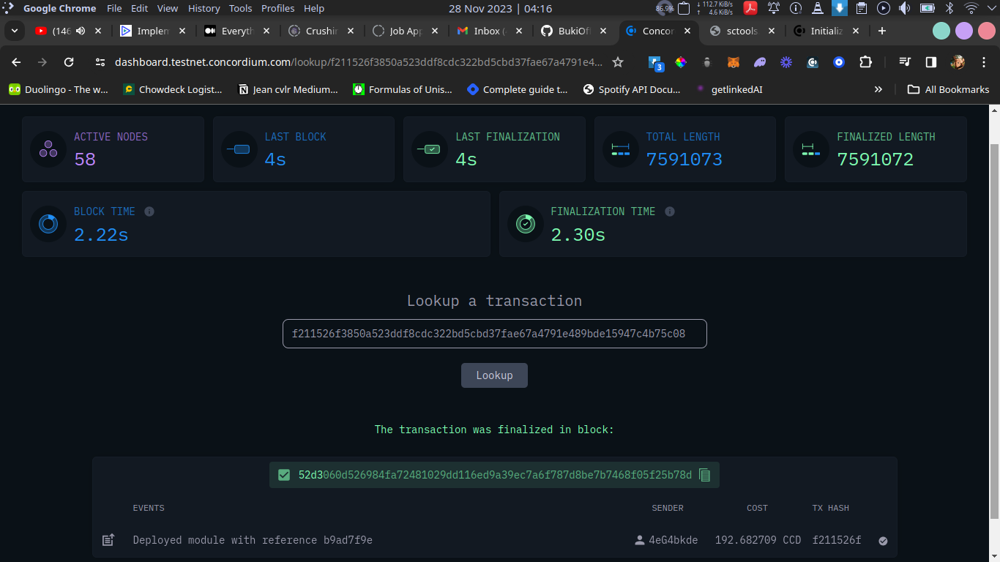
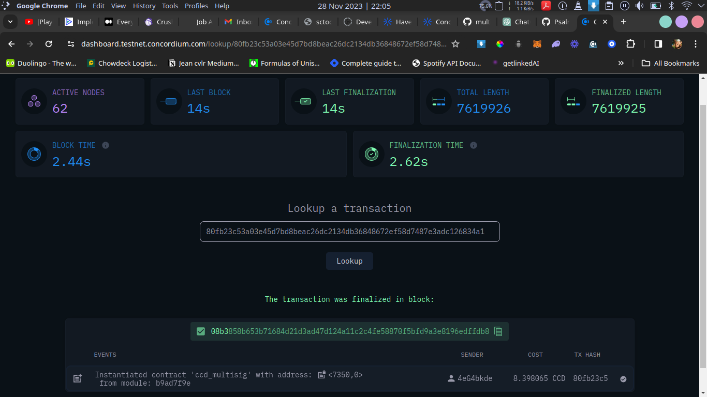
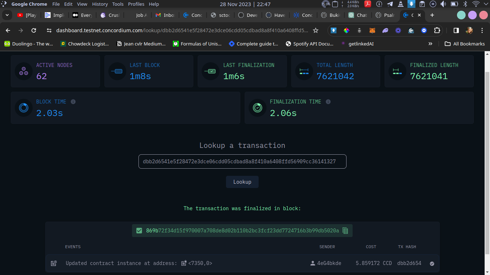

# multisig-contract

# Overview

This project implements a multi-signature smart contract on the Concordium blockchain. It also includes scripts that interact with the blockchain (testnet).

# Smart Contract Functions

The smart contract implements the folowing functions:

Write functions:

- `initialize()`: To initalize the smart contract and build state using the initial parameters.
- `insert()`: Allows the smart contract to receive ccd tokens.
- `create_transaction()`: Creates a transaction proposal pending approval from the signatories.
- `approve()`: Approves a transaction proposal, can only be called by a signatory.
- `transfer()`: Excutes a transaction if proposal is approved by all signatories.

Read functions:

- `view()`: To check the state of a deployed smart contract, returns a transaction proposal when given an tx_id.
- `get_administrators()`: Returns all the signatory of a Smart contract module.
- `get_approvals_remaining()`: Returns the number of approvals needed for transaction to be excuted.

# Running the code

The code was deployed with the following command:

```
./concordium-client_6.1.0-1 --grpc-ip node.testnet.concordium.com module deploy concordium-out/module.wasm.v1 --name ccd_multisig --sender mywallet
```

The code ran succesfully and returned a module reference, and an initialization transaction hash

```
Deploying module....
Sent transaction with hash: b9ad7f9eabaedd45b7cdec88a784c9fe53606aff18dced28e9d8e948207dc9a1
Transaction finalized: tx_hash=b9ad7f9eabaedd45b7cdec88a784c9fe53606aff18dced28e9d8e948207dc9a1 module_ref=f211526f3850a523ddf8cdc322bd5cbd37fae67a4791e489bde15947c4b75c08
```

### Deploying on the concordium block explorer



The code was initialized with the following command:

```
./concordium-client_6.1.0-1 --grpc-ip node.testnet.concordium.com contract init ccd_multisig --parameter-json init.json --contract ccd_multisig --energy 10000 --sender mywallet
```

The code ran succesfully and returned a transaction hash, block and status

```
Initialize contract from module....
Transaction '80fb23c53a03e45d7bd8beac26dc2134db36848672ef58d7487e3adc126834a1' sent to the baker.
Transaction is finalized into block 08b3858b653b71684d21d3ad47d124a11c2c4fe58870f5bfd9a3e8196edffdb8 with status "success" and cost 8.398065 CCD (1988 NRG).
```

### Initializing on the concordium block explorer



The code was updated (get_administrators) with the following command:

```
./concordium-client_6.1.0-1 --grpc-ip node.testnet.concordium.com contract update 7350 --entrypoint get_administrators --parameter-json admins.json --energy 10000 --sender mywallet
```

The code ran succesfully and returned a transaction hash, block and status

```
Update contract....
Transaction 'dbb2d6541e5f28472e3dce06cdd05cdbad8a8f410a6408ffd56909cc36141327' sent to the baker.
Transaction is finalized into block 869b72f34d15f970007a708de8d02b110b2bc3fcf23dd7724716b3b99db5020a with status "success" and cost 5.859172 CCD (1389 NRG).
```

### Updating on the concordium block explorer



Signatories accounts used for this demonstration are:

```
4eG4bkdeJLMX2cCjYqoJnFufKB87dGMiGSBBeN2stvVhqR48ww
4UD4rW7cCvB9ZBs2CQSodtSgEzhvyFeVXymewCFYeQG7xKAnfe
3NV3wrJvKUKCarhG79sj2kTPUhd3bvsZtYWRauTqb8VNG378bF
```
